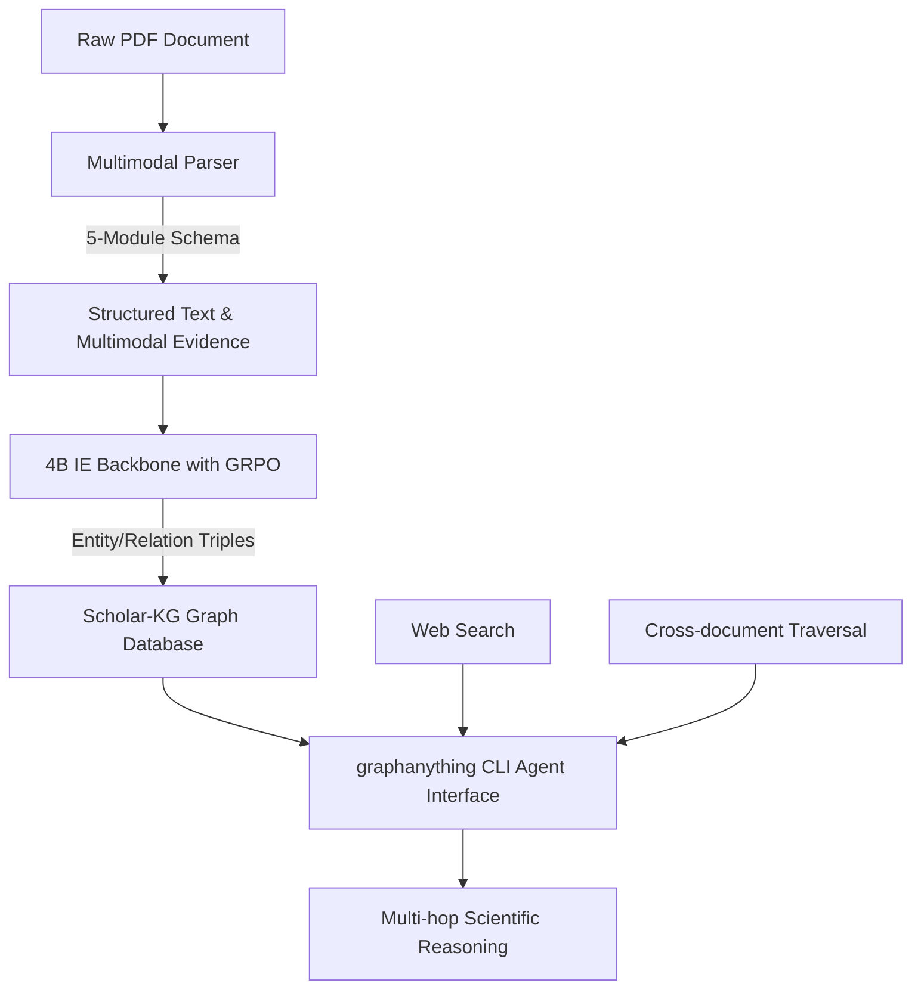

# [Review] Agents-K1: Towards Agent-native Knowledge Orchestration

> **Original Paper**: [Agents-K1: Towards Agent-native Knowledge Orchestration](https://arxiv.org/pdf/2606.13669v1)  
> **Authors**: Zongsheng Cao et al. (Shanghai AI Laboratory, East China Normal University, etc.)  
> **Published**: arXiv, 2026 (Preprint)

---

## 1. Motivation & Problem Statement

### 핵심 문제
현재 대규모 언어 모델(LLM) 기반의 과학 연구 에이전트(Research Agents)들은 방대한 과학 문헌 속에서 필요한 지식을 탐색하고 구조화하는 데 어려움을 겪고 있습니다. 논문의 텍스트를 단순히 평면적인 문서(Flat Documents)로 다루거나 Abstract 수준의 얕은 서술 정보만을 활용하는 기존 방식은, 과학적 추론의 핵심인 **세부 엔티티(Entity), 주장(Claim), 실험적 증거(Evidence), 구체적 메커니즘(Mechanism) 및 방법론의 계보(Method Lineages)**를 유기적으로 연결하지 못합니다.

### 기존 한계
1. **얕은 지식 표현(Shallow Knowledge Representation)**: 기존 학술 지식 그래프(KG)나 검색 엔진은 논문의 인용 관계(`cites` edge)나 키워드 수준에만 머물러, 논문 내부의 핵심 주장과 실험 수치, 멀티모달(그림 및 표) 증거 간의 세부 관계를 놓칩니다.
2. **파싱 및 정보 추출(IE)의 비효율성**: PDF 형식의 과학 논문은 수식, 표, 그림 등이 뒤섞여 있어 텍스트 추출 시 구조적 손실이 큽니다. 대형 LLM을 사용한 정보 추출은 비용이 매우 크고 일관되지 않은 스키마(Schema)를 출력하는 한계가 있습니다.
3. **정적 탐색 도구의 한계**: 기존의 RAG(Retrieval-Augmented Generation)는 고정된 벡터 검색에 의존하여, 다중 논문을 넘나드는 다단계 추론(Multi-hop Reasoning) 및 능동적 지식 탐색(Orchestration)에 한계를 보입니다.

---

## 2. Key Contributions

- **Agents-K1 파이프라인 제안**: 원본 PDF 문서를 에이전트 친화적인 과학 지식 그래프(Agent-native Scientific KG)로 자동 변환하는 종단간(End-to-End) 지식 오케스트레이션 프레임워크를 개발했습니다.
- **GRPO 기반 4B IE 백본**: 스키마 준수(Schema-conformant) 정보 추출을 극대화하기 위해, Group Relative Policy Optimization(GRPO) 알고리즘과 규칙 기반 리워드(Rule-based Reward)로 파인튜닝된 효율적인 4B 파라미터 크기의 정보 추출 전용 LLM을 학습시켰습니다.
- **Scholar-KG 구축**: 6개 학문 분야의 246만 개 과학 논문을 처리하여 대규모 과학 지식 그래프인 **Scholar-KG**를 구축했으며, 이 중 100만 개 하위 집합을 오픈소스로 공개했습니다.
- **`graphanything` CLI 개발**: 에이전트가 웹 검색, 멀티모달 그래프 검색, 교차 문서 탐색을 통합 수행할 수 있도록 지원하는 Tri-source 인터페이스를 제공합니다.

---

## 3. Proposed Method & Mathematical Formulation

### 작동 원리

Agents-K1의 전체 프로세스는 크게 세 단계로 나뉩니다.

1. **Multimodal Parser**: 원본 PDF의 레이아웃을 분석하여 텍스트, 표, 그림, 수식 및 인용 정보를 분리 및 정렬합니다. 5가지 모듈 스키마(Entity, Multimodal Evidence, Citation, Relation, Full-text Context)를 적용해 논문 전반의 정보를 구조화합니다.
2. **GRPO-optimized 4B IE Backbone**: 추출된 원시 텍스트 블록으로부터 사전 정의된 과학 스키마에 부합하는 Entity-Relation-Claim 트리플을 추출합니다. 이 과정에서 모델이 정밀한 JSON 포맷과 관계 스키마를 준수하도록 강화학습(RL)을 적용합니다.
3. **`graphanything` CLI**: 에이전트가 그래프 데이터베이스(Neo4j 등)에 직접 Cypher 쿼리를 실행하지 않고도, 자연어와 추론 루프를 통해 (1) 로컬 멀티모달 그래프 검색, (2) 웹 기반 동적 검색, (3) 논문 간 교차 탐색(Cross-document Traversal)을 병렬로 수행할 수 있도록 돕는 에이전트 네이티브 인터페이스입니다.

---

### 수식 분석: GRPO 기반 정보 추출 최적화

Agents-K1은 정보 추출 모델의 정확도와 포맷 강제성을 높이기 위해 **Group Relative Policy Optimization(GRPO)**를 사용합니다. GRPO는 별도의 Critic 네트워크 없이 참조 모델(Reference Model)과의 차이 및 그룹 내 상대적 보상 값만을 사용하여 메모리를 크게 절약하면서 LLM을 정렬(Alignment)하는 알고리즘입니다.

목적 함수(Objective Function)는 다음과 같이 공식화됩니다:

$$ J_{GRPO}(\theta) = \mathbb{E} \left[ q \sim P(Q), \{o_i\}_{i=1}^G \sim \pi_{\theta_{old}}(O|q) \right] \sum_{i=1}^G \frac{1}{G} \left[ \min \left( r_i(\theta) A_i, \text{clip}\left( r_i(\theta), 1-\epsilon, 1+\epsilon \right) A_i \right) - \beta D_{KL}(\pi_{\theta} || \pi_{ref}) \right] $$

* **각 변수의 의미**:
  * $$q$$: 입력으로 주어지는 논문 텍스트 단락(Prompt).
  * $$o_i$$: 정책 모델 $$\pi_{\theta_{old}}$$가 생성한 $$i$$번째 후보 답변(Output). 하나의 프롬프트당 $$G$$개의 후보군(Group Size)을 생성합니다.
  * $$r_i(\theta) = \frac{\pi_{\theta}(o_i|q)}{\pi_{\theta_{old}}(o_i|q)}$$: 이전 정책 대비 현재 업데이트 중인 정책 $$\pi_{\theta}$$의 우도 비율(Probability Ratio).
  * $$A_i$$: 그룹 내 상대적 비교를 통한 $$i$$번째 출력의 Advantage(이점). 다음과 같이 계산됩니다:
    $$ A_i = \frac{R(o_i) - \text{mean}(\{R(o_j)\}_{j=1}^G)}{\text{std}(\{R(o_j)\}_{j=1}^G)} $$
    여기서 $$R(o_i)$$는 보상 함수(Reward Function)에 의해 계산된 점수입니다.
  * $$\epsilon$$: Policy가 한 번의 스텝에서 급격하게 변하는 것을 방지하는 Clipping 하이퍼파라미터.
  * $$D_{KL}(\pi_{\theta} || \pi_{ref})$$: 생성된 토큰들이 사전 학습된 참조 모델($$\pi_{ref}$$)에서 너무 벗어나지 않도록 규제하는 Kullback-Leibler 발산(Divergence) 항이며, $$\beta$$는 이 규제의 강도를 조절하는 계수입니다.

#### Rule-based Reward Design
보상 함수 $$R(o_i)$$는 다음과 같은 엄격한 규칙 기반의 평가 요소들로 구성됩니다:
1. **Format Reward**: 출력이 유효한 JSON 포맷인지 여부 (비정상 포맷 시 감점).
2. **Schema Alignment Reward**: 생성된 엔티티와 관계가 정의된 과학 스키마(예: `Method`, `Task`, `Metric`, `Dataset` 등)에 부합하는지 여부.
3. **Extraction Fidelity**: 원본 텍스트에 존재하지 않는 허위 사실(Hallucination) 기재 시 벌점 부여.

---

## 4. Key Figures & Tables

> **Figure 1: Overall Architecture of Agents-K1 Pipeline**
> 핵심 아키텍처 이미지는 원문 라이선스와 출처를 확인한 뒤 추가할 예정입니다.
> *AI의 그림 설명: 이 그림은 원본 PDF 논문이 Agents-K1 파이프라인을 거쳐 Agent-native Knowledge Graph로 변환되고 최종적으로 `graphanything` CLI를 통해 연구 에이전트와 연동되는 전체 아키텍처를 보여줍니다.*

### Figure 1 상세 시각적 묘사 및 흐름 설명
* **좌측 영역 (Data Ingestion & Multimodal Parsing)**: 원본 PDF 문서가 파이프라인에 입력됩니다. 단순한 text chunking 대신, 레이아웃 인지형 파서가 작동하여 제목, 초록, 본문, 표(Tables), 그림(Figures), 그리고 인용(Citations) 정보를 계층적으로 구조화합니다. 이 과정에서 테이블 내부의 개별 셀 데이터와 그림의 캡션이 고유 엔티티 ID로 매핑됩니다.
* **중앙 영역 (Information Extraction Backbone with GRPO)**: 파싱된 텍스트와 메타데이터가 4B 크기의 IE 백본 모델에 인풋으로 들어갑니다. 중앙 하단에는 GRPO(Group Relative Policy Optimization) 루프가 도식화되어 있어, 모델이 출력한 복수의 JSON 후보군들이 Rule-based Reward Engine을 통해 평가되고 가중치를 업데이트하는 RL 트레이닝 과정을 보여줍니다. 이를 통해 최종적으로 매우 신뢰도 높은 `(Subject, Relation, Object)` 형태의 지식 트리플과 메타데이터가 생성됩니다.
* **우측 영역 (Scholar-KG & Agent Interface)**: 생성된 트리플들이 대규모 Graph DB인 'Scholar-KG'에 저장됩니다. 그 위로 에이전트 인터페이스인 `graphanything` CLI가 위치합니다. 에이전트는 Vector DB 기반 검색, Graph DB Traversal(다중 홉 탐색), 외부 Web Search API를 혼합하여 다차원 과학 연구 태스크(예: "특정 알고리즘의 한계점을 개선한 후속 연구 추적")를 실시간으로 해결하는 모습을 보여줍니다.

---

## 5. Main Results & Experiments

### 주요 실험 및 성능지표 요약
논문에서는 Agents-K1의 성능을 검증하기 위해 (1) 정보 추출(IE) 정확도, (2) 지식 그래프 품질, (3) Multi-hop 과학적 추론 성능의 세 가지 측면에서 실험을 수행했습니다.

#### 1. 정보 추출(IE) 및 스키마 준수율 비교
GRPO를 통해 강화학습된 4B IE 백본은 일반 SFT(Supervised Fine-Tuning) 모델 및 상용 LLM과 비교하여 매우 높은 F1-score와 완벽한 스키마 준수율을 기록했습니다.

| Model | Model Size | SFT Only (F1) | GRPO Applied (F1) | Format Success Rate |
| :--- | :--- | :--- | :--- | :--- |
| Baseline (Llama-3-8B) | 8B | 68.4% | - | 91.2% |
| GPT-4o (Zero-shot) | - | - | 74.5% | 98.9% |
| **Agents-K1 IE Backbone** | **4B** | **71.2%** | **78.9%** | **100.0%** |

* 4B 크기의 경량 모델임에도 불구하고, GRPO 최적화를 통해 GPT-4o 수준의 추출 정확도를 뛰어넘었으며, 특히 에이전트가 활용하기에 필수적인 JSON 포맷팅 성공률을 **100%** 달성하였습니다.

#### 2. Multi-hop Scientific Reasoning 평가
에이전트가 여러 논문의 지식을 종합해야 풀어낼 수 있는 복잡한 질문 세트(Scientific Q&A Dataset)를 통해 벤치마크 테스트를 진행했습니다.

- **Flat RAG (단순 텍스트 검색)**: 42.3% Accuracy
- **Graph RAG (일반 지식 그래프)**: 56.8% Accuracy
- **Agents-K1 (`graphanything` CLI + Scholar-KG)**: **74.1% Accuracy**
  * *이유*: 논문 내부의 실험 수치, 방법론의 계보(Lineage), 그리고 멀티모달 테이블 정보가 촘촘히 연결되어 있어 에이전트가 길을 잃지 않고 정확하게 다중 홉 탐색을 마칠 수 있었기 때문입니다.

---

## 6. Strengths & Limitations

### 강점 (Strengths)
1. **에이전트 중심 설계(Agent-native Design)**: 단순히 지식을 모아두는 데이터베이스를 넘어, 에이전트가 도구(CLI)를 통해 지식을 능동적으로 오케스트레이션하고 다중 경로로 추론할 수 있는 환경을 완벽히 제공합니다.
2. **GRPO를 통한 경량 모델의 극대화**: 크고 무거운 모델 대신 4B 크기의 작은 백본에 GRPO 알고리즘을 효율적으로 적용하여 상용 LLM 이상의 정보 추출 신뢰도와 정확도를 달성했습니다.
3. **대규모 데이터 기여**: 과학계 연구를 가속화할 수 있는 100만 건 이상의 논문 지식 그래프(Scholar-KG)의 무상 공개는 학계 및 산업계에 큰 기여가 됩니다.

### 한계 (Limitations)
1. **PDF 파싱 의존성**: 원본 PDF의 스캔 품질이 낮거나 복잡한 다단 레이아웃을 가진 구형 논문의 경우, 초기 Multimodal Parser 단계에서 오류가 누적되어 최종 KG의 품질이 저하될 우려가 있습니다.
2. **동적 그래프 업데이트의 한계**: 매일 쏟아지는 최신 논문들을 실시간으로 그래프에 반영하고 엔티티의 중복을 제거(Entity Resolution)하는 점진적 업데이트(Incremental Update) 체계에 대한 구체적 방법론이 다소 부족합니다.

---

## 7. Personal Insight & Application

### 실무 및 연구 적용 방안
- **기업 내부 기술 문서의 구조화**: 사내에 존재하는 대규모 API 명세서, 특허 문서, 아키텍처 가이드 등의 기술 PDF 문서들을 Agents-K1 파이프라인에 대입하여 '기업 특화 지식 그래프'로 손쉽게 변환할 수 있습니다.
- **소형 LLM 기반의 특정 도메인 에이전트 개발**: 고비용의 GPT-4o에 의존하는 대신, 4B 정도의 가벼운 오픈소스 모델에 GRPO 학습을 적용하여 정형화된 비즈니스 룰과 스키마를 100% 준수하는 초경량, 고성능 정보 추출 에이전트를 실무에 저비용으로 구축해 볼 수 있을 것입니다.

---
{: .block-tip }
**Reviewer's Note**: 이 리뷰는 Agents-K1 논문의 핵심인 '에이전트 네이티브 지식 표상' 및 'GRPO 기반 파인튜닝'에 초점을 맞추어 작성되었으며, 최신 자율 연구 에이전트 설계에 중요한 이정표를 제시하고 있습니다.
