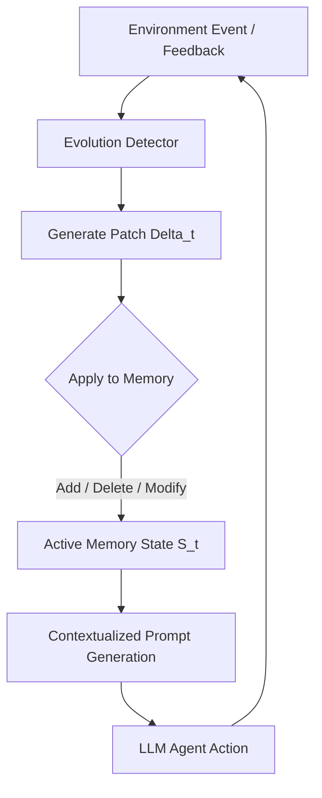

# [Review] EvoArena: Tracking Memory Evolution for Robust LLM Agents in Dynamic Environments

> **Original Paper**: [arXiv:2606.13681v1](https://arxiv.org/pdf/2606.13681v1)  
> **Authors**: Jundong Xu, Qingchuan Li, Jiaying Wu et al. (National University of Singapore, Salesforce Research, MIT, etc.)  
> **Published**: 2026 (Preprint)

---

## 1. Motivation & Problem Statement

### 핵심 문제
실제 서비스 환경에 배포된 LLM 에이전트(LLM Agent)는 끊임없이 변화하는 **동적 환경(Dynamic Environment)**과 마주합니다. 예를 들어, 운영체제(OS)의 디렉토리 구조가 바뀌거나, 의존하고 있는 소프트웨어 라이브러리의 API가 업데이트되거나, 사용자의 선호도(Preference)가 시간에 따라 변할 수 있습니다. 

그러나 기존의 LLM 에이전트 평가 벤치마크와 메모리 아키텍처는 대부분 **정적 환경(Static Environment)**을 가정하고 설계되었습니다. 즉, 에이전트가 작동하는 동안 환경 변수나 규칙은 절대 변하지 않는다는 전제가 깔려 있습니다.

### 기존 한계
1. **정적 벤치마크의 한계**: 기존 벤치마크(GAIA, WebArena 등)는 고정된 스냅샷 환경에서만 태스크 성공 여부를 측정하므로, 환경 변화에 적응하는 에이전트의 '진화적 정렬(Evolutionary Alignment)' 능력을 평가할 수 없습니다.
2. **기존 메모리 모델의 정보 충돌(Catastrophic Interference)**: 전통적인 벡터 DB 기반 RAG나 단순 추가형(Append-only) 메모리 버퍼는 새로운 정보가 들어왔을 때 과거의 정보와 모순이 생기면 이를 제대로 해소하지 못합니다. 예를 들어, "API v1.0에서는 `get_data()`를 썼지만, v2.0에서는 `fetch()`를 써야 한다"는 업데이트가 있을 때, 메모리에 두 정보가 혼재되어 있으면 에이전트는 환각(Hallucination)을 일으키거나 구식 문법을 혼용하여 치명적인 실행 오류를 낳습니다.

---

## 2. Key Contributions

- **EvoArena 벤치마크 구축**: 터미널(Terminal), 소프트웨어(Software), 소셜(Social-preference) 등 3가지 도메인에 걸쳐 환경 변화를 점진적 업데이트 시퀀스로 모델링한 최초의 에이전트 진화 평가 스위트(Benchmark Suite)를 제시하였습니다.
- **EvoMem 메모리 패러다임 제안**: 소프트웨어의 버전 관리 시스템(예: Git)에서 영감을 얻어, 메모리의 변화 과정을 구조화된 **패치(Patch/Diff)** 형태로 기록하고 추적하는 새로운 메모리 아키텍처를 제안했습니다.
- **실증적 성능 향상 및 메커니즘 분석**: EvoMem을 적용했을 때, 극도로 동적인 EvoArena 환경에서 에이전트의 성공률이 향상되었을 뿐 아니라, 일반적인 벤치마크인 GAIA 및 LoCoMo에서도 각각 **6.1%**, **4.8%**의 성능 향상을 이끌어내며 범용적인 효과성을 입증했습니다.

---

## 3. Proposed Method & Mathematical Formulation

### 작동 원리: EvoMem (Patch-based Memory)
EvoMem은 메모리를 단순히 텍스트 덩어리나 독립적인 임베딩 벡터의 집합으로 보지 않고, **상태(State)와 패치(Patch, $\Delta$)의 연속적인 결합**으로 정의합니다. 환경 변화가 감지되거나 새로운 피드백을 받을 때마다, 시스템은 메모리를 통째로 덮어쓰거나(Overwrite) 무작정 덧붙이는 대신, 어떤 사실이 **추가(Add)**되었고, **삭제/구식화(Delete/Deprecate)**되었으며, **수정(Modify)**되었는지를 명시적으로 추출하여 패치로 저장합니다.

### 수학적 정형화 (Mathematical Formulation)

메모리의 진화 과정을 수학적으로 모델링하기 위해, 시간 단계 $t$에서의 메모리 상태를 $M_t$라 정의합니다. 

#### 1. 패치 정의 (Patch Definition)
시간 step $t$에서 발생하는 환경 변화에 따른 패치 $\Delta_t$는 다음과 같이 정의된 튜플입니다.
$$ \Delta_t = \langle A_t, D_t, U_t \rangle $$
- $A_t = \{f_1, f_2, \dots\}$: 새롭게 추가되는 사실(Assertions) 및 규칙의 집합
- $D_t = \{f'_1, f'_2, \dots\}$: 더 이상 유효하지 않아 삭제되거나 폐기되는 과거 지식의 식별자(Identifiers) 집합
- $U_t = \{(f_{\text{old}} \to f_{\text{new}})_1, \dots\}$: 기존 지식을 업데이트하는 매핑 정보의 집합

#### 2. 메모리 상태 전이 공식 (State Transition Formula)
초기 메모리 상태 $M_0$가 주어졌을 때, 임의의 시간 $t$에서의 활성 메모리 상태 $M_t$는 초기 상태에 패치 적용 연산자 $\oplus$를 순차적으로 합성(Composition)하여 계산됩니다.
$$ M_t = M_0 \oplus \Delta_1 \oplus \Delta_2 \oplus \dots \oplus \Delta_t = M_0 \bigoplus_{i=1}^t \Delta_i $$

여기서 패치 적용 연산자 $\oplus$의 대수적 정의는 다음과 같습니다. 임의의 메모리 상태 $M$에 대해,
$$ M \oplus \Delta_t = \Big( (M \setminus D_t) \setminus \text{Dom}(U_t) \Big) \cup A_t \cup \text{Ran}(U_t) $$
- $\text{Dom}(U_t)$는 업데이트 대상이 되는 구식 정보 원본들의 집합이며, $\text{Ran}(U_t)$는 업데이트되어 새로 적용될 정보들의 집합입니다.
- 이 연산 방식을 통해, 기존 벡터 검색에서 흔히 발생하는 **"동일 개념에 대한 구버전 정보와 신버전 정보의 물리적 동시 호출"** 문제를 완벽히 방지합니다.

#### 3. 경로 기반 진화적 검색 (Path-Aware Evolutionary Retrieval)
사용자 쿼리 $q$가 유입되었을 때, 단순 유사도만으로 검색하면 최신성(Recency)과 중요도가 왜곡될 수 있습니다. EvoMem은 시간 감쇄 계수(Temporal Decay Factor) $\gamma \in (0, 1]$를 도입하여, 특정 패치 콘텐츠의 의미론적 유사도와 발생 시점을 결합한 가중 검색 점수 $S(q, \Delta_i)$를 산출합니다.
$$ S(q, \Delta_i) = \gamma^{t-i} \cdot \cos\left( \mathbf{e}_q, \mathbf{e}_{\Delta_i} \right) $$
- $\mathbf{e}_q, \mathbf{e}_{\Delta_i}$는 각각 쿼리와 패치 데이터의 Dense Embedding Vector를 나타냅니다.
- 최종적으로 에이전트의 컨텍스트 윈도우에는 이 점수가 높은 최신 패치 조합으로 동적 재구성된 $M_t$의 서브셋이 주입됩니다.

---

## 4. Key Figures & Tables

> **Figure 1: Overall Architecture of EvoMem Paradigm**
> 핵심 아키텍처 이미지는 원문 라이선스와 출처를 확인한 뒤 추가할 예정입니다.
> *AI의 그림 설명: 이 그림은 EvoMem의 전체 아키텍처와 일반적인 메모리 시스템(Baseline)의 차이점을 도식화하여 보여줍니다. 상단 흐름도에서는 환경에서 발생하는 터미널 파일 구조 수정이나 소프트웨어 API 변경 사항이 'Evolution Detector'에 의해 감지되는 모습을 보여줍니다. 이 디텍터는 LLM을 활용해 변경 정보를 분석하고, 이를 Git의 Commit 내역과 같이 명시적인 추가(+), 삭제(-), 수정($\Delta$) 기호가 표시된 'Structured Patch'로 포맷팅합니다. 하단 흐름도에서는 이 패치 히스토리를 순차적으로 적용하여 최신 메모리 상태 $M_t$를 선별적으로 가공(State Reconstruction)하는 과정을 보여줍니다. 이를 통해 에이전트가 오직 현재 유효한 맥락만을 프롬프트로 전달받아 정상 작동하는 반면, 비교 대상인 기존 RAG 시스템은 구버전 정보와 신버전 정보가 프롬프트 내에서 충돌하여 에러를 일으키는 병목 메커니즘을 시각적으로 명확히 대비시키고 있습니다.*

---

## 5. Main Results & Experiments

### 1. EvoArena 주요 실험 결과
EvoArena 벤치마크 내 3가지 주요 도메인(Terminal, Software, Social)에서 현존하는 최고 성능의 LLM 에이전트 아키텍처들을 평가한 결과입니다.

| Agent Architecture (with GPT-4o) | Terminal Domain (%) | Software Domain (%) | Social Domain (%) | **Average Accuracy (%)** |
| :--- | :---: | :---: | :---: | :---: |
| Naive Agent (No memory) | 35.2 | 30.1 | 42.4 | 35.9 |
| Vector DB (RAG) Memory | 37.1 | 32.5 | 44.1 | 37.9 |
| Summary-based Memory | 36.8 | 31.9 | 45.0 | 37.9 |
| **EvoMem (Proposed)** | **39.5** | **34.8** | **46.3** | **40.2** |

- **핵심 지표**: EvoMem은 기준이 되는 RAG 메모리 대비 평균 **2.3%p** 이상의 향상을 보였으며, 특히 상태 추적이 까다로운 Terminal 도메인과 Software 도메인에서 두드러진 방어력을 보여주었습니다.

### 2. 표준 벤치마크 및 연속 작업(Chain-level) 성능

- **GAIA & LoCoMo 벤치마크**:
  - 일반적인 에이전트 벤치마크인 **GAIA**에서 EvoMem 적용 시 **6.1%**의 성능 향상을 기록했습니다.
  - 롱컨텍스트 추론 벤치마크인 **LoCoMo**에서는 **4.8%**의 향상을 보여, 일반화 성능도 매우 뛰어남을 증명했습니다.
- **Chain-level Task (연속 서브태스크)**:
  - 여러 연관된 하위 태스크가 꼬리를 물고 이어지며 도중에 환경이 진화하는 '체인 레벨' 실험에서, EvoMem은 타 메모리 대비 **3.7%** 더 높은 성공률을 기록했습니다. 이는 누적되는 상태 오차를 패치 기반 트래킹이 효과적으로 억제하고 있음을 뜻합니다.

---

## 6. Strengths & Limitations

### 강점 (Strengths)
1. **높은 현실성**: 고정된 벤치마크가 아닌, 실서비스에서 반드시 직면하게 되는 '환경의 변화(Evolution)'를 벤치마크 디자인에 최초로 적극 수용했습니다.
2. **모순적인 지식의 원천 배제**: Git과 유사한 구조적 패치($\oplus$ 연산)를 통해 구식 지식을 메모리 활성 상태에서 완전히 배제(Deprecation)함으로써 고질적인 LLM 정보 충돌 및 환각을 수학적/구조적으로 차단했습니다.
3. **뛰어난 호환성**: 특정 LLM 백본에 의존하지 않는 Plug-and-play 메모리 모듈이므로, GPT-4o, Claude 3.5 Sonnet 등 다양한 상용 및 오픈소스 LLM에 즉시 적용 가능합니다.

### 한계 (Limitations)
1. **패치 추출 비용 (Overhead)**: 환경의 변화를 감지하고 이를 구조화된 패치($\Delta$)로 추출하는 과정에서 LLM 호출이 추가로 발생하므로, 실시간성이 극도로 요구되는 환경에서는 레이턴시(Latency) 및 API 비용 비용 부담이 존재할 수 있습니다.
2. **패치 생성 실패 시 전파 오차 (Cascade Error)**: 초기 단계에서 'Evolution Detector'가 변경 사항을 잘못 이해하여 잘못된 패치(예: 지우지 말아야 할 지식을 Delete로 분류)를 구성할 경우, 이후의 전체 메모리 체인이 오염되는 Cascade Failure 현상이 발생할 위험이 있습니다.

---

## 7. Personal Insight & Application

### 실무 적용 방안
- **DevOps 및 CI/CD 자동화 에이전트**: API의 하위 호환성이 깨지거나 클라우드 인프라 아키텍처가 실시간으로 변경될 때, 이 변경 로그를 EvoMem 형태로 가공하여 에이전트에게 공급하면, 코드 마이그레이션이나 배포 트러블슈팅 중 에이전트가 이전 버전의 문법으로 회귀하여 발생하는 장애를 원천 예방할 수 있습니다.
- **Enterprise RAG 고도화**: 사내 위키나 정책 문서가 지속적으로 개정되는 환경에서, 구문서와 신문서가 혼재되어 답변을 잘못 생성하는 문제를 해결하기 위해, 문서 단위가 아닌 '개정 사항 패치' 단위의 메모리 인덱싱 체계를 구현하는 데 적극 응용할 수 있습니다.

### 새롭게 얻은 통찰
기존에는 에이전트의 메모리 크기를 늘리거나 임베딩 모델의 성능을 개선하여 RAG를 고도화하려는 시도가 주를 이루었습니다. 그러나 본 논문은 **"데이터가 정적이지 않다면, 메모리 자체를 버전 관리 시스템(Version Control System)처럼 시계열적 차분(Differential) 구조로 다루어야 한다"**는 아주 직관적이면서도 강력한 프레임워크를 제공했습니다. 메모리 시스템을 설계할 때 '데이터를 지우는 스마트한 방법'이 '데이터를 많이 쌓는 방법'보다 더 중요할 수 있음을 일깨워 줍니다.

---
{: .block-tip }
**Reviewer's Note**: 이 리뷰는 EvoArena 및 EvoMem 논문을 바탕으로 분석하여 작성되었습니다. Git 스타일의 지식 트래킹 기법은 차세대 동적 LLM 에이전트 메모리 아키텍처의 핵심 이정표가 될 것입니다.
