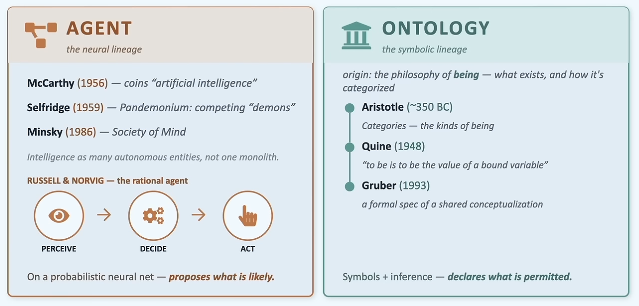
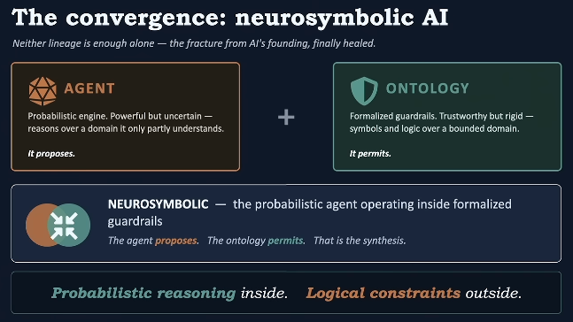
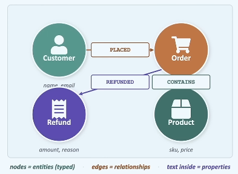
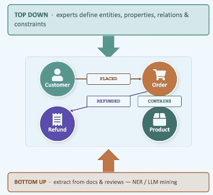
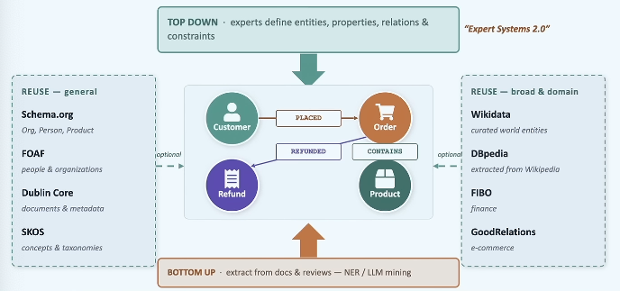
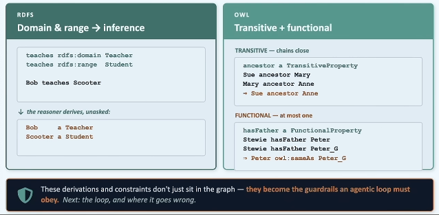
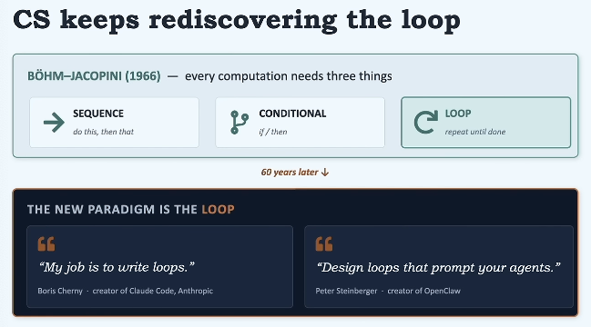
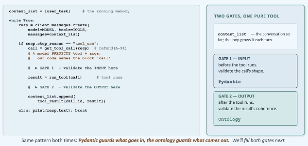
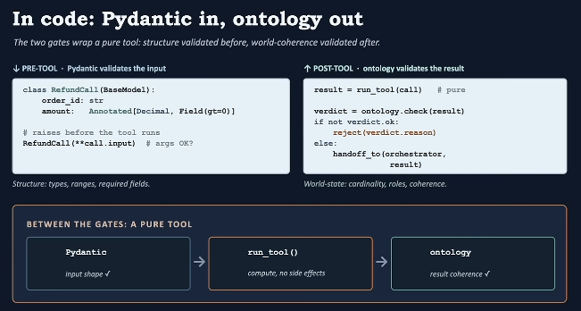
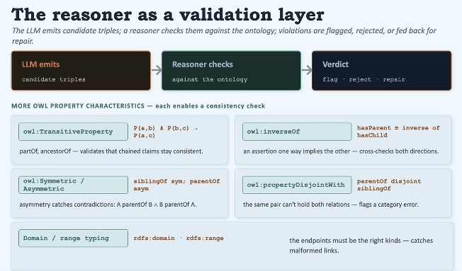

> **Video**: [Why Agentic Systems Need Ontologies — Frank Coyle, UC Berkeley](https://www.youtube.com/watch?v=Sir59K8ZDPU&t=5s)
>
> **Speaker**: Frank P. Coyle, PhD

> Nothing is a mistake. There's no win and no fail. There's only make.

## 1. Two Lineages

현재 AI는 서로 다른 두 계보인 **Agent**와 **Ontology**에서 발전했다.



* **Agent**: Probabilistic system
  - LLM은 학습된 패턴을 바탕으로 가장 그럴듯한(probabilistic) 결과물을 생성한다.
  - 입력을 인식(Perceive)하고, 판단(Decide)을 내린 뒤 행동(Act)한다.

* **Ontology**: Symbolic system
  - 지식과 관계를 시스템 외부의 형식 언어로 구조화하여 표현한다.
  - 명시된 규칙에 따라 결정론적으로 검증할 수 있지만, open world의 모든 지식을 구조화하려고 하면 확장하기 어렵다.


## 2. The Convergence: Neurosymbolic AI



발표자는 Agent와 Ontology를 결합하여 확률 모델에 안전장치를 두는 방식을 강조한다.

> Probabilistic reasoning inside. Logical constraints outside.
>
> 확률적 추론은 내부에, 논리적 제약은 외부에 둔다.

즉, LLM 자체를 완벽하게 논리적으로 만들기보다는 LLM의 출력을 기반으로 행동하기 전에 결정론적인 검증(deterministic verification)을 거치게 한다.

> **The agent proposes. The ontology permits.**


## 3. Ontology



스키마가 데이터의 형태를 정의한다면, 온톨로지(ontology, data as graphs)는 그 데이터가 도메인 안에서 무엇을 의미하며 어떤 관계가 논리적으로 가능한지까지 표현한다.

### 3.1 그렇다면 온톨로지는 어떤 방법으로 구축하는 게 좋을까?

앞서 언급한 것처럼 현실 세계는 예외가 많고 계속 변하기 때문에 사람이 모든 경우를 규칙으로 커버하는 것이 불가능하다.

여기서 발표자는 아래와 같이 주장한다.

> 온톨로지가 현실 세계 전체를 설명할 필요는 없다. 에이전트가 반드시 지켜야 할 좁고 중요한 영역만 설명하면 된다.

즉, 일반적인 이해, 계획 및 설계 등은 LLM에게 맡기고 안전, 데이터 무결성과 같은 영역만 형식화해서 온톨로지를 거대한 지식 체계가 아닌 작고 강한 가드레일로 사용한다.



* **Top-down**: 도메인 전문가가 업무 개념과 규칙을 직접 정의
* **Bottom-up**: 기존 문서와 데이터에서 개념과 관계를 추출

#### 기존 분류 체계를 재사용하자!

이미 특정 산업이나 업무 영역에서 표준 분류 체계나 어휘가 존재한다면 이를 재사용하는 것이 좋다.



* 시스템 간 의미가 일치하여 데이터 통합이 쉬워진다.
* 이미 검증된 관계와 분류를 활용할 수 있어 개념을 반복해서 정의할 필요가 없다.
* 에이전트와 기존 시스템 사이에 공통 언어가 생긴다.

### 3.2 온톨로지를 표현하는 기술: RDFS, OWL



RDFS와 OWL을 사용하면 단순히 정보를 저장하는 것을 넘어 타입과 관계를 추론하고 제약을 표현할 수 있다.

* **Domain / Range**: 관계의 주체와 대상 타입을 정의하고 추론
* **Transitive Property**: 관계의 연쇄를 통해 새로운 관계를 추론
* **Functional Property**: 하나의 주체가 해당 관계의 값을 최대 하나만 갖도록 제한
* **Disjoint Classes**: 동시에 같은 타입일 수 없는 개념을 정의
* **Enumerated Values**: 상태값을 미리 정의한 집합으로 제한

## 4. Agent

### 4.1 LOOP



일반적인 에이전트는 `[인식 → 판단 → 행동 → 결과 관찰 → 다시 판단]`의 루프를 반복한다.

그리고 루프는 아래와 같은 위험을 지닌다.

* Infinite loops (무한 루프)
* Goal drift (목표 이탈)
* Token-cost blowups (비용 폭증)

발표자는 이 문제를 단순히 프롬프트를 수정하는 것만으로 고치기에는 한계가 있다고 주장한다.


### 4.2 A Claude agent loop: call a tool, check stop_reason, repeat

```python
context_list = [user_task] # the running memory

while True:
    response = client.messages.create(
        model=MODEL,
        tools=TOOLS,
        messages=context_list,
    )

    if response.stop_reason == "tool_use":
        call = get_tool_call(response) # refund(A-91)

        # GATE 1 - validate the INPUT here

        result = run_tool(call)

        # GATE 2 - validate the OUTPUT here

        context_list.append(tool_result(call.id, result))
    else:
        break
```

위 Claude 도구 사용 루프에서 `run_tool(call)`은 모델이 도구 호출을 생성하면 바로 실제 작업을 실행한다. 따라서 실행 전후에 두 개의 검증 지점을 둔다.



* **GATE 1 (Pydantic)**: [**데이터의 모양**] 도구가 실행되기 전 호출 구조 검사
  * 필드 존재 여부
  * 타입 일치 여부: 금액 필드에 문자열을 전달하지는 않는지
  * 필수 인자값 포함 여부: `order_id`가 누락되지 않았는지
  * 숫자 범위 유효 여부: 환불 금액이 음수인지
  * 문자열 형식 확인: 잘못된 날짜 형식인지

* **GATE 2 (Ontology)**: [**데이터의 의미와 관계**] 도구 반환 결과가 도메인 의미와 규칙에 맞는지 검사
  * 해당 주문은 이미 환불됐는가
  * 환불이 올바른 주문을 가리키는가
  * 수령 계정의 역할이 고객인가
  * 상태 전이가 허용되는가
  * 결과가 현재 상태와 모순되지 않는가



Pydantic은 입력의 타입과 형태가 올바른지 확인하지만, 그 행동이 비즈니스 규칙상 허용되는지까지는 판단하지 못한다. 온톨로지는 현재 상태와 객체 간 관계를 기준으로 이 의미적 일관성을 검증한다.

## 5. Summary



이 발표는 모든 지식을 온톨로지로 옮기자는 이야기가 아니다. 핵심은 **확률적 에이전트가 반드시 지켜야 할 좁고 중요한 규칙을 모델 외부에 명시하자**는 것이다.

### 핵심 설계 원칙

1. **모든 것을 모델링하지 않는다.**
   - 돈의 이동, 권한과 역할, 상태 전이, 중복 실행처럼 시스템이 절대 깨뜨리면 안 되는 불변조건부터 형식화한다.

2. **프롬프트와 규칙의 역할을 구분한다.**
   - 목표, 우선순위, 계획 방식처럼 유연한 판단은 프롬프트에 둔다.
   - 허용값, 타입, 횟수 제한, 객체 관계처럼 반드시 지켜야 하는 조건은 온톨로지와 검증 코드에 둔다.

3. **검증 실패를 제어 흐름으로 다룬다.**
   - `행동 거부 → 위반 규칙 반환 → 행동 재생성 → 재검증 → 실행`의 순서로 처리한다.
   - 단순히 프롬프트에 "다시 잘 생각해 봐"라고 요청하는 것만으로는 충분하지 않다.

4. **부작용은 검증 이후로 미룬다.**
   - 결제, 환불, 이메일 발송, 데이터 삭제처럼 되돌리기 어려운 작업은 후보 결과를 먼저 검증한 뒤 반영한다.
   - 에이전트가 판단 과정에서 직접 상태를 변경하지 않도록 실행 계층을 분리하는 것이 중요하다.

### 결론

온톨로지도 만능은 아니다. 잘못 정의된 온톨로지는 잘못된 행동을 허용할 수 있고, 업무 규칙이 바뀌면 함께 갱신해야 한다. 또한 시간 순서, 집계, 복잡한 프로세스 규칙은 별도의 정책 엔진이나 검증 코드가 필요할 수 있다.

따라서 실무에서는 다음과 같은 계층을 함께 구성하는 것이 적절하다.

```text
Pydantic / JSON Schema
+ Ontology / Knowledge Graph
+ Policy / Rule Engine
+ Transaction / Idempotency
+ Permission Check
+ Audit Log
+ Human Approval
```

발표의 핵심은 에이전트의 신뢰성을 더 좋은 모델이나 더 긴 프롬프트에만 맡기지 않는 것이다. **온톨로지는 확률적 에이전트와 결정론적 소프트웨어 사이에서 행동의 허용 여부를 판단하는 논리적 계약 계층**이다.
