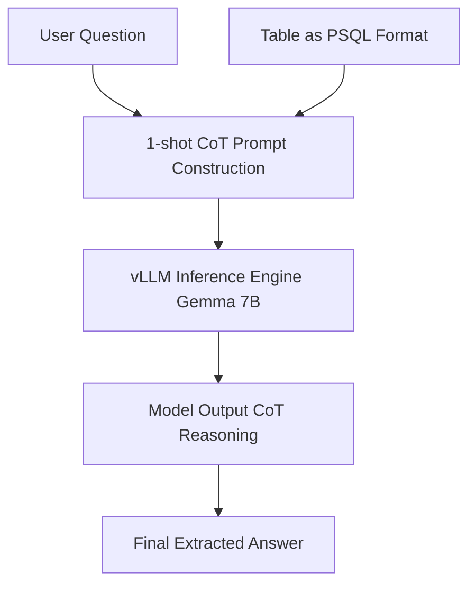

# 표 처리(Table Understanding) 기반 질의응답 Gemma 7B 벤치마크 리서치

RAG(검색 증강 생성) 시스템에서 가장 까다로운 원본 데이터 포맷 중 하나는 **표(Table)** 형태의 구조적 데이터입니다. 텍스트와 달리 표는 행(Row)과 열(Column)의 2차원적 계층 구조 및 합계, 평균 등의 수학적 추론 요소를 포함하기 때문입니다. 본 연구는 AITQA 데이터셋을 활용해 Gemma 7B 기반의 표 이해 QA 실험 파이프라인을 구축하고, 질의 유형별 성능 하락의 원인을 규명한 실험 보고서입니다.

---

## 🎯 연구 요약 & 핵심 성과
- **목표:** 표 데이터의 최적 텍스트 파싱 포맷을 규명하고, 프롬프트 엔지니어링 설계를 통해 테이블 질의응답 정확도를 극대화.
- **실험 모델:** Gemma 7B (vLLM 인프라 기반 추론 최적화)
- **주요 기여:**
  - pandas DataFrame을 psql 텍스트 포맷으로 변환하여 프롬프트 컨텍스트에 주입하는 전처리 Loader 설계.
  - 표의 행 계층 구조(Row Hierarchy)와 추론 로직(Decision Process)을 유도하는 **1-shot CoT(Chain-of-Thought) 프롬프팅** 최적화.
  - 질문 유형(Table-driven vs KPI-driven)에 따른 LLM 성능 세분화 분석 수행.
- **성과:** **전체 정확도(Accuracy) 76.34% 달성**. 단순 값 검색(79.05%) 대비 성능이 떨어지는 추론형(KPI-driven) 질의(69.66%)의 병목 요인 분석 및 표 구조 최적 파싱 가이드라인 수립.

---

## 🛠 Tech Stack
- **Inference Engine:** vLLM
- **Frameworks & Libraries:** Gemma 7B, pandas, Python
- **Dataset:** AITQA (AI Table Question Answering benchmark dataset)
- **Methodology:** 1-shot Chain-of-Thought (CoT) Prompting, SQL-like formatting

---

## 💡 주요 실험 설계 및 분석

### 1. 표의 텍스트 표상(Representation) 최적화
HTML이나 CSV, 마크다운 등의 표 포맷은 토큰 소모량이 크거나 LLM이 컬럼 간의 구분을 온전히 하지 못하는 문제를 유발합니다. 본 실험에서는 pandas DataFrame을 PostgreSQL의 쿼리 결과 텍스트 포맷(`psql format`)으로 인코딩하여 주입하였습니다.
- `psql format`은 경계선(`|`, `-`)과 컬럼 헤더가 명확하여, LLM이 표의 2차원 셀 위치를 2D 격자 구조로 가장 잘 인지할 수 있도록 유도합니다.

```text
| Year | Metric | Value  |
|------|--------|--------|
| 2023 | Revenue| 1,200M |
| 2023 | Profit | 150M   |
| 2024 | Revenue| 1,500M |
```

### 2. 의사결정 프로세스(Decision Process) 유도 프롬프팅
단순히 질문과 표만 던지는 제로샷(Zero-shot) 구조를 탈피하고, 모델이 표에서 목표 데이터를 찾는 경로를 명시하는 **1-shot Chain-of-Thought (CoT)** 구조를 수립했습니다.
- **예시 경로 유도:** `Step 1. Identify Target Column ➡️ Step 2. Locate Matching Row ➡️ Step 3. Compute Value`



---

## 📊 실험 결과 및 리서치 분석

### 1. 질문 유형에 따른 정확도(Accuracy) 분석
실험 결과, 질문의 성격에 따라 모델의 문제 해결 역량이 극명히 갈렸습니다.

| Query Type | Description | Target Data | Accuracy (%) |
|:---|:---|:---|:---:|
| **Table-driven (값 검색)** | 표 내부의 특정 셀 값을 그대로 찾아 추출하는 질의 | 특정 셀 매핑 | **79.05%** |
| **KPI-driven (추론 필요)** | 복수 행의 값을 합산하거나 비율을 계산해야 하는 질의 | 수치 연산 및 비교 | **69.66%** |
| **Total (전체 평균)** | - | 전체 데이터셋 | **76.34%** |

### 2. 성능 분석 및 해결 대안 수립
- **병목 분석:** KPI-driven 질의(정확도 69.66%)에서는 행 간의 연산(합산, 비교)에 사용될 수치 파싱 과정에서 부동소수점 오차나 단위 변환(M, K 등) 오류가 발생하여 최종 계산 결과가 틀어지는 현상이 가장 큰 원인이었습니다.
- **해결 대안:** RAG 파이프라인에서 복잡한 테이블 쿼리가 입력될 경우, LLM에게 직접 연산을 시키는 것보다 **TableQA 에이전트(Agent)**를 구성하여 LLM이 Python Pandas code나 SQL Query를 생성하게 하고 이를 execution 환경에서 실행하여 결괏값만 취하는 **Code-as-Policies** 구조로 전환할 필요가 있음을 증명하였습니다.
