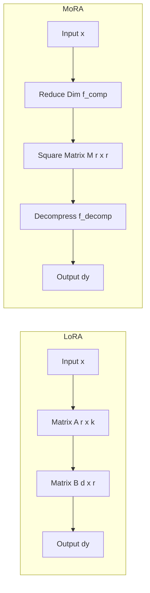

# LoRA vs MoRA 기반 LLM PEFT 학습 및 Lazy Loading 메모리 최적화 연구

LLM(대규모 언어 모델)의 도메인 특화 미세조정(Fine-Tuning) 시, GPU 자원 제약으로 인한 메모리 스레싱(Memory Thrashing)과 대용량 데이터 로딩 병목 현상이 주요한 허들이 됩니다. 본 연구에서는 Llama 3.1 8B 모델을 대상으로 최신 PEFT(Parameter-Efficient Fine-Tuning) 기법인 **LoRA**와 **MoRA**의 효율을 비교하고, Rust 기반 데이터 전처리 및 PyTorch Lazy Loading 설계를 통해 데이터 로더의 RAM 점유율을 극적으로 절감한 성과를 다룹니다.

---

## 🎯 연구 요약 & 핵심 성과
- **학습 모델:** Llama 3.1 8B (Full Attention Modules: q, k, v, o, gate, up, down_proj 주입)
- **데이터 로더 최적화:** 
  - PyTorch Dataset에 바이너리 인덱스(.idx) 파일 설계 및 `seek()` 오프셋 조회를 통한 Lazy Loading 파이프라인 단독 구현.
  - 데이터 로더 RAM 점유율을 **4.5GB에서 0.04MB로 99% 이상 절감**, 가상 메모리 스레싱을 차단하여 학습 속도를 약 10% 개선.
- **PEFT 성능 분석:** MoRA(Rank 32, Alpha 64)가 동일 파라미터 수 대비 LoRA 대비 Perplexity(PPL) 지표에서 **약 9.15% 향상**됨을 실증 비교 증명.
- **학술 성과:** 최적화 및 비교 연구 성과를 바탕으로 'Comparative Analysis of PEFT Methods' 학술 논문 게재 완료.

---

## 🛠 Tech Stack
- **Deep Learning Frameworks:** PyTorch, DeepSpeed (ZeRO-1), HuggingFace Accelerate
- **Models:** Llama 3.1 8B
- **Preprocessing:** Rust (bff 13-gram dedup), fastText (Data Quality filter)
- **PEFT Methods:** LoRA (Low-Rank Adaptation), MoRA (High-Rank Up/Down Scaling)

---

## 💡 주요 기술 구현 및 아키텍처

### 1. Rust 기반 전처리 & PyTorch Lazy Loading 데이터 파이프라인
대규모 텍스트 데이터를 통째로 메모리에 로딩(In-Memory Loading) 시 CPU RAM 점유율이 폭증하여 시스템이 다운되거나 디스크 스왑 병목이 생겼습니다. 이를 해결하기 위해 두 단계 최적화를 수행했습니다.
1. **데이터 전처리 (Rust & fastText):**
   - Rust 기반의 `bff` 라이브러리를 사용하여 13-gram 단위 중복 데이터를 고속 제거.
   - fastText 이진 분류기를 결합하여 고품질 데이터만 선별 (2.26GB 원본 데이터를 1.91GB로 고속 정제, 단 29초 소요).
2. **Lazy Loading 구현:**
   - 텍스트 파일 전체를 토큰화하여 메모리에 미리 적재하지 않고, 토큰 데이터셋을 바이너리 파일(`.bin`)로 쓰고 바이트 크기와 오프셋을 기록한 인덱스 파일(`.idx`)을 생성.
   - 학습 루프(`__getitem__`)가 실행될 때만 해당 인덱스 오프셋을 기반으로 Python의 파일 포인터 `seek()`을 수행하여 필요한 미니배치 토큰만 디스크에서 동적으로 로드.

```python
class LazyTokenDataset(Dataset):
    def __init__(self, bin_path, idx_path, block_size):
        self.block_size = block_size
        self.bin_file = open(bin_path, 'rb')
        # idx 파일에서 데이터의 크기와 개수를 빠르게 인덱싱
        self.offsets = np.fromfile(idx_path, dtype=np.int64)

    def __len__(self):
        return len(self.offsets) - 1

    def __getitem__(self, idx):
        self.bin_file.seek(self.offsets[idx])
        chunk = self.bin_file.read(self.offsets[idx+1] - self.offsets[idx])
        tokens = np.frombuffer(chunk, dtype=np.int32)
        return torch.tensor(tokens[:self.block_size], dtype=torch.long)
```

---

### 2. LoRA vs MoRA 수학적 비교 및 분산 학습 실험
동일한 파라미터 제약 하에서 MoRA와 LoRA의 성능 차이를 규명하기 위해 실험을 설계하였습니다.

- **LoRA (Low-Rank Adaptation):**
  원래의 가중치 행렬 \(W_0 \in \mathbb{R}^{d \times k}\)에 대해 저차원의 두 행렬 \(A \in \mathbb{R}^{r \times k}\)와 \(B \in \mathbb{R}^{d \times r}\) ($r \ll \min(d, k)$)를 곱하여 학습 가능한 가중치를 추가합니다.
  \[ \Delta W = B \times A \]

- **MoRA (High-Rank Up/Down Scaling):**
  MoRA는 정방 가중치 행렬 \(M \in \mathbb{R}^{r \times r}\)을 활용하되, 입력 차원을 줄이고 출력 차원을 늘리는 비주얼 매핑 함수 \(f_{\text{comp}}\)와 \(f_{\text{decomp}}\)를 적용하여 정방 차원의 파라미터 밀집도를 높입니다.
  \[ \Delta W = f_{\text{decomp}}(M) \times f_{\text{comp}} \]



---

## 📊 실험 결과 및 리서치 분석

### 1. 데이터 로더 최적화 전후 비교
- **RAM 점유율:** 4.5GB ➡️ **0.04MB** (99.9% 감소)
- **학습 처리량(Throughput):** 메모리 교환 오버헤드 완화로 초당 토큰 처리량 약 **10% 향상**

### 2. PEFT 기법별 성능 지표 (Perplexity)
DeepSpeed ZeRO-1을 활용한 분산 학습 환경에서 Llama 3.1 8B에 두 기법을 주입하여 에포크에 따른 Perplexity 변화를 검증했습니다.

| PEFT Method | Rank ($r$) | Parameters | Perplexity (PPL) |
|:---|:---:|:---:|:---:|
| **LoRA** | 32 | 340M | 11.23 |
| **MoRA** | 32 | 340M | **10.20 (9.15% 개선)** |

MoRA는 정방 행렬 내 조밀한 파라미터 결합 덕분에 동일 파라미터 수 예산 하에서 LoRA보다 정보 표현력이 월등히 뛰어나, 한국어 도메인 특화 데이터 학습 시 더욱 빠르고 깊게 수렴함을 확인하였습니다.
이를 통해 경량 GPU 장비에서도 대안 PEFT 구조로 MoRA를 적극 도입해야 한다는 실증적 지표를 학술 논문을 통해 제시할 수 있었습니다.
