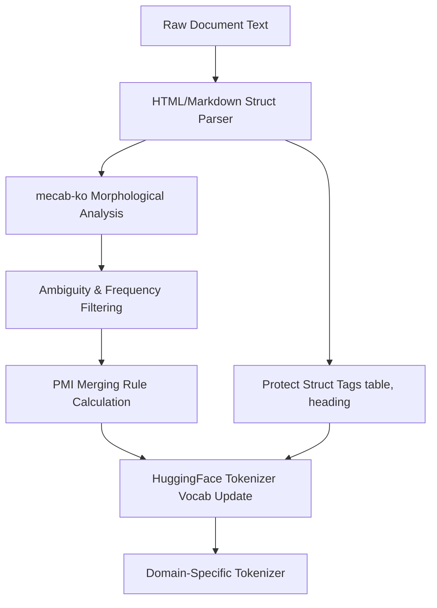

# 도메인 특화 커스텀 토크나이저 개발 및 최적화

특정 전문 도메인(공공, 법률, 특허 등)의 텍스트를 LLM에 효과적으로 학습시키기 위해서는 일반적인 말뭉치로 학습된 범용 토크나이저(Tokenizer)만으로는 한계가 있습니다. 도메인 특화 어휘가 과분할(Over-segmentation)되거나 문서 구조 정보(Table, Heading 등)가 유실되는 문제를 해결하기 위해, 형태소 분석 및 확률 기반의 새로운 토크나이저 어휘 확장 및 정제 파이프라인을 연구 및 구축하고 특허를 출원하였습니다.

---

## 🎯 연구 목표 & 요약
- **목표:** 특정 도메인 문서에 포함된 특수 용어 및 문서 구조 태그를 온전히 보존하면서 토큰화 효율(Compression Ratio)을 개선.
- **주요 기여:** 
  1. mecab-ko-dic 형태소 분석을 활용한 고품질 후보 어휘 정제.
  2. PMI(Pointwise Mutual Information) 연관성을 결합한 토큰 병합 규칙 확장.
  3. 표(HTML `<table>` 태그 등) 및 서식(`<heading>`) 구조의 토큰 손실 방지 로직 적용.
- **성과:** 도메인 용어의 과분할율 감소 및 LLM Context Window의 토큰 소모 효율 향상. 관련 핵심 기술 특허 출원 완료.

---

## 🛠 Tech Stack
- **Languages:** Python (Tokenizer build/evaluation)
- **Libraries:** HuggingFace Tokenizers, mecab-ko-dic, tokenizers (Rust binding)
- **Evaluation Tools:** Python Regex parser, pandas (Vocab statistics analysis)

---

## 💡 주요 기술적 과제 및 구현

### 1. 형태소 정보 기반의 어휘(Vocab) 정제
단순히 빈도(Frequency)만을 바탕으로 BPE(Byte-Pair Encoding) 토큰을 확장할 경우, 불완전하게 잘린 접사나 무의미한 문자열 조합이 어휘집에 남게 됩니다. 이를 방지하기 위해 형태소 분석기 `mecab-ko-dic`을 전처리 단계에 연동하였습니다.
- **표층빈도(Surface Frequency)**와 **품사별 모호도(Ambiguity)**를 산출하여 정형화된 형태소 단위를 우선 추출.
- 조사나 어미 등 LLM 어휘 확장에 기여도가 낮은 성분을 통계적으로 필터링하여 노이즈를 억제하고 어휘집 효율 극대화.

### 2. PMI(상호 정보량) 기반 토큰 병합 규칙 최적화
토큰 병합(Token Merging) 시 두 글자 또는 두 하위 단어의 연관관계를 수학적으로 검증하기 위해 **PMI(Pointwise Mutual Information)**를 활용하였습니다.

\[ \text{PMI}(x, y) = \log_2 \frac{P(x, y)}{P(x)P(y)} \]

자주 함께 등장하는 도메인 고유 명사들(예: `녹색분류체계`, `연구장비`)의 결합 확률 \(P(x, y)\)이 단독 등장 확률 \(P(x), P(y)\) 대비 유의미하게 높을 때에만 BPE Merge Rule에 병합 규칙을 추가하여, 단어가 지나치게 미세하게 쪼개지는 현상을 방지하였습니다.

### 3. 문서 구조 토큰 보존 로직 (Structure-Preserving)
Markdown이나 HTML 포맷으로 작성된 구조적 텍스트가 일반 토크나이저를 거칠 때 `<table>`, `<tr>`, `<td>`, `<h1>` 등의 태그나 특수 서식이 온전히 인식되지 못하고 난독화되는 현상을 해결해야 했습니다.
- 토크나이저의 `Added Tokens` 및 `Special Tokens` 규칙을 활용하여 문서 구조 정의 토큰들을 정규 표현식 기반으로 특수 보호(Protected Tokens) 처리.
- 이를 통해 토크나이저가 구조적 텍스트를 인코딩할 때 표의 행/열 구분을 명확히 유지할 수 있게 되어, 후속 LLM의 RAG 답변 품질 향상에 기여.

---

## 📈 핵심 연구 성과
- **어휘 보존 성능:** 도메인 고유 용어의 과분할 방지로 평균 토큰 당 어절 매핑률이 개선되어 동일한 의미를 표현할 때 LLM이 입력받는 토큰의 수가 절감되었습니다.
- **모델 문맥 이해도 향상:** 특히 표 데이터 등 구조가 살아있는 텍스트를 입력받을 때 구조 파괴 현상이 억제되어 추론 태스크 성능이 개선되었습니다.
- **특허 출원 완료:** 본 최적화 파이프라인 및 구조 보존 로직에 대한 독자 기술성을 인정받아 2025년 특허 출원을 완수하였습니다.
