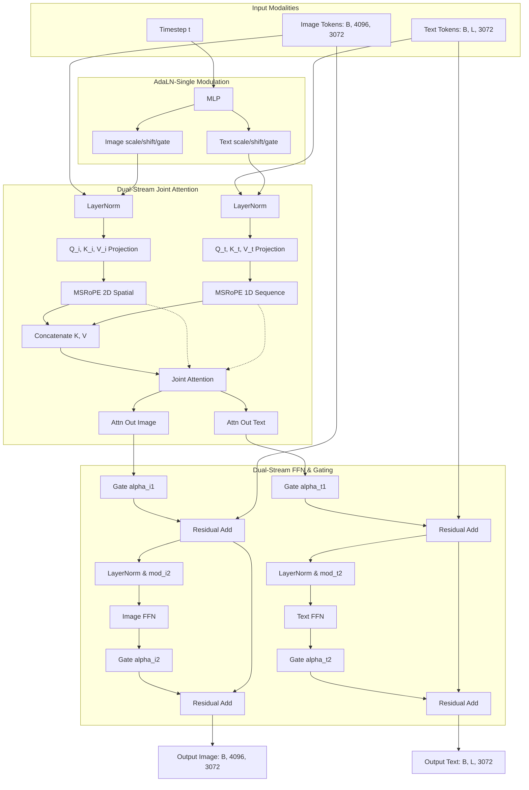

# Qwen-Image-2512 학습기 (2) - 모델 아키텍처 및 모델 성능

VLM(Vision-Language Model) 학습을 위해 baseline으로 사용할 Qwen-Image 모델 아키텍처 파악은 필수적이다. 이에 **Qwen-Image Technical Report (arXiv:2508.02324)** 논문을 바탕으로 **Qwen-Image-2512** 모델의 이중 인코딩(Dual-Encoding) 메커니즘과 MMDiT Block을 비롯한 내부 연산 및 수식, 그리고 벤치마크 성능을 체계적으로 정리하였다.

---

## 1. Introduction: Qwen-Image의 핵심 설계 사상

Qwen-Image는 텍스트 기반 이미지 생성(T2I, Text-to-Image)과 지시어 기반 이미지 편집(TI2I, Text-guided Image Editing) 영역을 모두 아우르는 차세대 이미지 생성 파운데이션 모델이다. 이 모델이 해결하고자 한 핵심 과제와 설계 사상은 다음과 같이 요약할 수 있다.

* **복잡한 프롬프트 정렬 (Complex Prompt Alignment)**: 텍스트 지시어(프롬프트)의 세부 조건들을 실제 이미지 안의 시각적 요소(위치, 색상, 개수, 텍스트)와 일대일로 정확히 일치(정렬)시키는 기술을 의미한다.
  > 💡 **핵심 직관 (Intuition)**
  > * **구체적 예시**: *"배경에 빨간 사과가 있고, 그 위에 파란색 나비가 앉아 있으며, 나비 날개에 'VLM'이라는 영문 글자가 적혀 있는 이미지"*를 주문했을 때, 사과를 파랗게 그리거나 글자를 깨진 상태로 그리지 않고 모든 세부 요소를 1:1로 매핑하여 정확히 그려내는 능력이다.
  > * **해결 원리**: Qwen-Image는 사물 위치(Bounding Box)와 텍스트 내용이 정밀 주석 처리된 대규모 학습 데이터를 확보하고, 합성 및 데이터 밸런싱이 포함된 강력한 데이터 파이프라인(Robust Data Pipeline)을 설계하여 이 문제를 해결하였다.

* **커리큘럼 학습 (Curriculum Learning)을 통한 텍스트 렌더링**: 아주 기초적인 글자 표현에서 시작해 점진적으로 단락 수준(Paragraph-level) 및 레이아웃 민감형(Layout-sensitive) 묘사로 확장하는 단계별 학습 레시피를 도입하였다.
  > 💡 **핵심 직관 (Intuition)**
  > * **구체적 예시**: 아이에게 글쓰기를 가르칠 때 가나다라(낱글자) ➡️ 단어 ➡️ 문장 ➡️ 긴 글짓기 순으로 난이도를 서서히 높여 학습시키는 방식과 같다.
  > * **해결 원리**: 이미지 내 글자를 그리는 고난도 학습을 위해 단일 알파벳/단어 ➡️ 문장 ➡️ 문단 및 레이아웃 배치 순서로 점진적 훈련을 설계하여, 영어 및 획이 복잡한 중국어 텍스트를 깨짐 없이 자연스럽게 인쇄하도록 만들었다. (다만 한글 텍스트의 경우 기본 모델 상태에서는 깨짐과 오류가 빈번하여, 향후 본 프로젝트의 커스텀 파인튜닝을 통해 보완해야 할 핵심 타겟이다.)

* **다중 작업 학습 (Multi-task Learning)을 통한 시각적 일관성**: 이미지 생성 및 편집 시의 시각적 정렬(Image Alignment)을 극대화하기 위해, 다양한 학습 태스크를 통합하여 훈련하는 프레임워크를 적용하였다.
  > 💡 **핵심 직관 (Intuition)**
  > * **구체적 예시**: 축구 선수가 킥 연습만 하는 대신 패스, 드리블, 전술 훈련을 동시에 진행하여 종합적인 경기 이해도를 높이는 것과 같다.
  > * **해결 원리**: 단순 텍스트-이미지 생성(T2I)에 머무르지 않고, 이미지 복원(I2I Reconstruction)과 이미지 편집(TI2I)을 아우르는 다중 작업 학습을 수행하여 Qwen2.5-VL의 시각-언어 의미 정보와 MMDiT 디퓨전 잠재 공간을 일치(Latent Alignment)시켰다.

* **이중 인코딩 (Dual-Encoding)을 통한 충실도 조절**: 의미론적(Semantic) 맥락 파악을 담당하는 **Qwen2.5-VL**과 시각적(Reconstructive) 세부 구조 보존을 담당하는 **VAE Encoder**를 동시에 활용하는 메커니즘을 구축하였다.
  > 💡 **핵심 직관 (Intuition)**
  > * **구체적 예시**: 미술 복원가가 그림을 수정할 때, 그림의 역사적 주제와 스토리를 분석하는 인문학적 분석가(Semantic)와 붓 터치나 물감 재질을 복제하는 기술적 분석가(Reconstructive) 두 명의 조언을 동시에 듣는 구조이다.
  > * **해결 원리**: 원본 이미지의 핵심 피사체 형태나 화질은 유지하면서도 지시어대로 정밀 편집할 수 있도록, Qwen2.5-VL을 통해 고수준 의미를 추출하고 VAE를 통해 픽셀 디테일을 분리 전달하여 시각적 충실도와 의미적 일관성의 균형을 잡았다.

* **생산자-소비자 (Producer-Consumer) 학습 프레임워크**: 멀티모달 인코딩을 담당하는 Producer 단계와 디퓨전 역전파(MMDiT Denoising)를 담당하는 Consumer 단계를 분리하여 파이프라인 병목을 최소화하였다.
  > 💡 **핵심 직관 (Intuition)**
  > * **구체적 예시**: 레스토랑 주방에서 보조 조수(Producer)가 채소와 고기를 미리 썰어두면, 메인 셰프(Consumer)는 오직 조리(불 다루기)에만 집중하여 회전율을 올리는 주방 분업 구조와 같다.
  > * **해결 원리**: 학습 도중 크기가 큰 VLM과 VAE의 인코딩 연산으로 인해 GPU가 대기하는 병목을 차단하기 위해, 인코더가 미리 특징을 추출해 큐(Queue)에 적재하고 디퓨전 모델은 가져다가 Denoising 연산만 집중 수행하도록 설계하여 학습 속도와 안정성을 극대화하였다.

---

## 2. Qwen-Image 아키텍처 개요

Qwen-Image-2512의 전체 아키텍처는 시각-언어 정보를 이해 및 추출하는 프론트엔드와 실물 이미지 복원 및 노이즈 제거를 담당하는 백엔드가 결합된 구조이다.


위 아키텍처에서 보이듯이 원본 이미지는 고수준 맥락 파악을 위한 Qwen2.5-VL 인코더 경로와 픽셀 수준 압축을 위한 VAE 인코더 경로로 이중화되어 흐르며, 최종적으로 MMDiT 백본 내부에서 결합되어 이미지를 점진적으로 복원해 나간다.

---

## 3. 핵심 모듈 상세 분석 및 데이터 흐름

Qwen-Image-2512의 핵심 컴포넌트인 **Qwen2.5-VL**, **Wan-2.1-VAE**, 그리고 **MMDiT Block**의 구체적인 연산 차원(Dimension)과 텐서의 변화 과정을 추적한다.

### ① Multimodal Large Language Model: Qwen2.5-VL

Qwen-Image는 텍스트 지시어 및 이미지 조건부 입력을 처리하는 텍스트 인코더 백본으로 frozen 상태의 **Qwen2.5-VL (7B)** 모델을 채택하였다.

* **선정 이유**:
  1. **사전 정렬된 시각-언어 공간**: 이미 이미지와 텍스트의 임베딩이 공간상에서 고도로 정렬(Aligned)되어 있어 디퓨전 학습의 수렴 속도를 극대화한다.
  2. **강력한 언어 모델 능력**: 복잡하고 긴 문맥의 프롬프트를 왜곡 없이 인코딩한다.
  3. **멀티모달 입력 지원**: 단일 텍스트(T2I)와 이미지+텍스트(TI2I) 입력을 단일 파이프라인으로 통합 처리할 수 있도록 돕는다.
* **임베딩 추출 메커니즘**:
  * Qwen2.5-VL의 최종 레이어(Last Layer)의 **Hidden State 출력**을 사용자 입력의 의미적 표상(User Input Representation)이자 디퓨전 생성의 조건(Condition)으로 활용한다.
  * **출력 텐서 차원**: `[Batch_Size, Sequence_Length, Hidden_Size (3584)]`
  * *Hidden Size (3584)의 의미*: 토큰 하나를 모델 내부에서 표현하는 임베딩 차원의 수이다. 토큰의 문맥적 의미와 역할을 3584차원의 고차원 벡터 공간에 매핑하여 표현함을 뜻한다.
* **프롬프트 템플릿 및 시스템 프롬프트 제어**:
  Qwen-Image는 입력 모달리티에 맞춰 사전 정의된 시스템 템플릿(System Prompt Template)을 적용하여 사용자 입력을 "이미지 생성에 적합한 표현"으로 가이드한다. 논문에 제시된 구체적인 구조는 다음과 같다.
  
  * **T2I (Text-to-Image) 시스템 템플릿 (Figure 7)**:
    사용자의 단순 텍스트 프롬프트($$	ext{<|user\_text|>}$$)를 받아들이기 전, 이미지의 디테일(색상, 수량, 글자, 모양, 크기, 질감, 공간 관계 등)을 자세히 서술하도록 유도하는 시스템 프롬프트 구조이다.
    ```markdown
    <|im_start|>system
    Describe the image by detailing the color, quantity, text, shape, size, texture, spatial relationships of the objects and background: <|im_end|>
    <|im_start|>user
    <|user_text|><|im_end|>
    <|im_start|>assistant
    ```
    
  * **TI2I (Text-guided Image Editing) 시스템 템플릿 (Figure 15)**:
    원본 레퍼런스 이미지($$	ext{<|user\_image|>}$$)와 사용자의 편집 지시어($$	ext{<|user\_text|>}$$)가 동시에 주어질 때 사용되는 멀티모달 프롬프트 구조이다. 시스템 프롬프트는 원본 이미지의 핵심 특징을 묘사한 뒤, 사용자의 지시어가 이미지를 어떻게 변경해야 하는지 설명하고, 원본과의 일관성을 유지하면서 요구사항을 충족하는 새로운 이미지를 생성하도록 지시한다.
    ```markdown
    <|im_start|>system
    Describe the key features of the input image (color, shape, size, texture, objects, background), then explain how the user's text instruction should alter or modify the image. Generate a new image that meets the user's requirements while maintaining consistency with the original input where appropriate. <|im_end|>
    <|im_start|>user
    <|vision_start|><|user_image|><|vision_end|><|user_text|><|im_end|>
    <|im_start|>assistant
    ```

---

### ② Variational AutoEncoder: Wan-2.1-VAE

디퓨전 모델이 고해상도 RGB 픽셀 공간(`1024x1024`)에서 직접 노이즈 제거 연산을 수행하는 것은 연산 비용이 비현실적으로 크다. 따라서 **Wan-2.1-VAE**를 활용하여 고해상도 이미지를 압축된 잠재 공간(Latent Space)으로 변환한 뒤 연산을 수행한다.

* **아키텍처 특징**: 싱글 인코더 - 듀얼 디코더(Single-Encoder, Dual-Decoder) 구조를 적용하여, 이미지와 비디오 잠재 변수 복원 시의 품질 손실을 최소화한다.
* **데이터 흐름**:
  1. 원본 이미지 $$\mathbf{x} \in \mathbb{R}^{B 	imes 3 	imes 1024 	imes 1024}$$ 입력.
  2. **VAE Encoder**가 이미지를 다운샘플링 및 채널 압축하여 잠재 변수 $$\mathbf{z} \in \mathbb{R}^{B 	imes 16 	imes 128 	imes 128}$$ 생성. (Spatial Downsampling Factor $$f=8$$, Latent Dimension $$z_{dim}=16$$ 적용)
  3. MMDiT에서 노이즈 제거(Denoising)를 거친 새로운 잠재 변수 $$\mathbf{z}' \in \mathbb{R}^{B 	imes 16 	imes 128 	imes 128}$$을 **VAE Decoder**에 입력.
  4. 복원된 RGB 이미지 $$\mathbf{x}' \in \mathbb{R}^{B 	imes 3 	imes 1024 	imes 1024}$$ 출력.

---

### ③ 실제 데이터 스트림 및 Tensor 차원 추적 (T2I/TI2I 공통)

이미지 해상도 `1024x1024` 입력 기준, 각 컴포넌트를 거치며 변화하는 텐서의 차원(Shape) 변화는 다음과 같다.

```
[입력 이미지 x] Shape: [B, 3, 1024, 1024]
       ↓
  (VAE Encoder) - Spatial Downsampling f=8
       ↓
[잠재 변수 z_t] Shape: [B, 16, 128, 128]
       ↓
  (Patchify) - patch_size=2로 2x2 영역을 평탄화 (16 x 2 x 2 = 64)
       ↓
[Image Tokens] Shape: [B, 4096, 64]   (128/2 = 64 -> 64x64 = 4096 tokens)
       ↓
  (Linear Projection) - 64 dim -> inner_dim (3072)
       ↓
[MMDiT Image Hidden States] Shape: [B, 4096, 3072]
```

동시에 텍스트 입력 채널의 변환은 다음과 같다.

```
[텍스트 지시어 및 이미지 조건]
       ↓
  (Qwen2.5-VL 7B Backbone) - Last Hidden State 추출
       ↓
[Text Tokens] Shape: [B, Text_Length, 3584]
       ↓
  (Linear Projection) - 3584 dim -> inner_dim (3072)
       ↓
[MMDiT Text Hidden States] Shape: [B, Text_Length, 3072]
```

---

### ④ MMDiT Block 내부 연산 메커니즘

MMDiT(Multi-Modal Diffusion Transformer) 내부에서는 60개의 **Dual-Stream Joint Attention Block**이 반복되며 이미지 토큰(`[B, 4096, 3072]`)과 텍스트 토큰(`[B, Text_Length, 3072]`)을 상호작용시킨다. 

#### ⚙️ 주요 하이퍼파라미터 명세 (MMDiT Specifications)

| 하이퍼파라미터 | 값 (Value) | 설명 (Description) |
| :--- | :---: | :--- |
| **`patch_size`** | `2` | VAE 잠재 공간(Latent Grid)을 하나의 Transformer 토큰으로 묶는 2D 공간 크기 |
| **`in_channels`** | `64` | patchify된 이미지 토큰의 입력 차원 ($$	ext{patch\_size} 	imes 	ext{patch\_size} 	imes 	ext{out\_channels} = 2 	imes 2 	imes 16$$) |
| **`out_channels`** | `16` | MMDiT가 최종적으로 예측 및 복원해야 하는 VAE Latent Channel 수 |
| **`num_layers`** | `60` | 이미지와 텍스트의 정렬 및 노이즈 예측을 수행하는 Dual-Stream MMDiT 블록 수 (층수) |
| **`attention_head_dim`** | `128` | 어텐션 헤드(Attention Head) 하나가 연산에 사용하는 특징 벡터 차원 수 |
| **`num_attention_heads`** | `24` | 어텐션 멀티헤드(Multi-head)의 개수 |
| **`inner_dim`** | `3072` | MMDiT 내부의 공통 hidden dimension 크기 ($$	ext{num\_attention\_heads} 	imes 	ext{attention\_head\_dim} = 24 	imes 128$$) |
| **`joint_attention_dim`**| `3584` | Qwen2.5-VL 백본으로부터 투입되는 텍스트 인코딩 히든 상태의 입력 차원 |

---

하나의 MMDiT Block 내부에서 수행되는 구체적인 연산 흐름은 다음과 같다.



> 💡 **핵심 직관 (Intuition) - 싱글 스트림(Single-Stream)과의 차이점**
> * **구체적 예시**: 이미지 토큰과 텍스트 토큰을 단순히 이어 붙여(Concat) 하나의 일반 트랜스포머에 넣으면, 이미지 토큰 수(4096개)가 텍스트 토큰 수에 비해 압도적으로 많기 때문에 텍스트의 조건부 신호가 무시되거나 학습 속도가 느려진다.
> * **해결 원리**: MMDiT는 **Dual-Stream(두 개의 독립된 흐름)** 구조를 채택하여 이미지 경로와 텍스트 경로를 따로 유지한다. Attention 연산 시에만 두 정보를 일시적으로 정렬하고, 각 스트림에 최적화된 개별 FFN(Feed-Forward Network)을 가동하여 텍스트 의미 정렬과 이미지의 세부 시각 정보 표현을 완벽하게 병렬 처리한다.

#### 1. AdaLN-Single (시간 임베딩 및 변조)
디퓨전 학습 시점인 타임스텝 $$t$$ 임베딩 정보는 각 블록의 입력단에서 두 스트림의 정규화 레이어 파라미터를 동적으로 변조(Modulation)하는 데 사용된다.
* 타임스텝 임베딩(Time Embedding)을 MLP 레이어에 통과시켜 각 스트림의 Scale($\gamma$) 및 Shift($eta$) 계수와 잔차 연결 스케일링을 위한 Gating 계수($lpha$)를 예측한다.
* 구체적으로, 단일 MLP를 활용하여 두 모달리티를 위한 변조 계수를 한 번에 계산한다:
  $$ (eta_{i,1}, \gamma_{i,1}, eta_{i,2}, \gamma_{i,2}, lpha_{i,1}, lpha_{i,2}, eta_{t,1}, \gamma_{t,1}, eta_{t,2}, \gamma_{t,2}, lpha_{t,1}, lpha_{t,2}) = 	ext{MLP}(c) $$
  여기서 $$c$$는 타임스텝 $$t$$의 임베딩 텐서이다.
* 입력 텐서들을 정규화한 뒤 예측된 계수로 다음과 같이 변조를 수행한다.
  $$ 	ext{adaLN}(X, \gamma, eta) = 	ext{LayerNorm}(X) \cdot (1 + \gamma) + eta $$

#### 2. Multimodal Scalable RoPE (MSRoPE) 적용 및 Joint Attention
두 스트림의 결합 어텐션을 계산할 때, 이미지 토큰(2D 공간 좌표)과 텍스트 토큰(1D 시퀀스 선형 좌표)의 서로 다른 기하학적 특성을 위치 임베딩에 반영하기 위해 **MSRoPE**를 사용한다.


위 그림은 텍스트와 이미지 토큰 간의 결합 위치 인코딩(Joint Positional Encoding) 전략 세 가지를 비교하여 보여준다. Qwen-Image는 모달리티 간 정렬을 극대화하기 위해 **MSRoPE (Ours)** 방식을 설계하여 적용하였다.

##### 1) 위치 인코딩 결합 전략 비교 분석 (Figure 8 상세)

* **A: Naïve Position Encoding Concatenation (단순 1D 직렬연결)**:
  이미지의 2D 구조를 고려하지 않고 1차원으로 직렬 평탄화($$0, 1, \dots, 8$$)한 뒤 텍스트 토큰($$9, 10, 11$$)을 연결한다. 이미지의 세로축 기하구조 정보를 잃게 되며, 해상도 확장 시 공간적 매핑이 완전히 소실된다.
* **B: Column-wise Position Encoding (가로축 편향 2D 매핑)**:
  이미지는 가로/세로를 고려한 2D 격자 인덱스($$(-1, -1)$$부터 $$(1, 1)$$까지)를 주입받고, 텍스트 토큰은 $$(2, 0), (3, 0)$$ 형태로 가로(width)축 방향으로만 위치 좌표가 매핑된다. 이 경우 텍스트 토큰의 공간적 영향력이 가로 방향에만 치우쳐 세로 방향(height) 이미지 토큰들과의 어텐션 상호작용 및 정렬 성능에 한계가 생긴다.
* **C: MSRoPE (Ours) - Diagonal Position Encoding (대각선 위치 인코딩)**:
  이미지의 2D 좌표축 중심을 $$(0, 0)$$으로 설정하고, 텍스트 토큰을 격자 상의 대각선 방향($$(2, 2), (3, 3), (4, 4)$$)으로 배치한다. 이를 통해 텍스트 토큰이 가로(width)와 세로(height) 양방향 모두에 기하학적으로 완벽히 대칭적인 공간 거리를 유지할 수 있게 된다. 가로나 세로 어느 한쪽으로 텍스트의 주의(Attention)가 편향되지 않고, 이미지의 가로/세로 모든 시각 정보와 고르게 상호작용(정렬)할 수 있게 된다.

##### 2) MSRoPE의 수학적 원리 (Mathematical Principle)

* **RoPE (Rotary Position Embedding)의 작용**:
  트랜스포머의 어텐션 연산은 두 토큰(쿼리 $$\mathbf{q}$$, 키 $$\mathbf{k}$$)의 내적(Dot Product)으로 구한다. RoPE는 위치 정보를 벡터에 더하는 대신, 위치 인덱스에 비례하는 각도만큼 벡터를 회전(Rotation)시키는 방식을 사용한다.
  위치 $$m$$에 있는 쿼리 $$\mathbf{q}_m$$와 위치 $$n$$에 있는 키 $$\mathbf{k}_n$$에 회전 행렬 $$R$$을 적용하여 내적을 구하면 아래와 같이 유도된다.
  $$ \langle \mathbf{q}_m, \mathbf{k}_n 
angle_R = (R_m \mathbf{q})^T (R_n \mathbf{k}) = \mathbf{q}^T (R_m^T R_n) \mathbf{k} = \mathbf{q}^T R_{n-m} \mathbf{k} $$
  이 식은 **두 토큰의 내적 결과가 오직 두 토큰 사이의 상대적 거리 $$(n-m)$$에 의해서만 결정**되도록 만들어 주어 위치적 일관성을 확보한다.

* **어텐션 헤드 차원 분할 (Dimension Splitting)**:
  MMDiT 내부에서 24개의 Attention Head 각각은 $$d=128$$차원의 벡터 크기를 가지며, MSRoPE는 이 $$128$$차원을 기하학적 특성에 맞게 분할하여 회전을 수행한다.
  
  * **이미지 토큰 ($$x, y$$ 2D 좌표)**:
    - 앞부분 반절인 **$$d/2 = 64$$차원**: 세로 좌표축 인덱스 $$y$$에 비례하는 회전 행렬 $$R_{	heta, y}$$를 적용한다.
    - 뒷부분 반절인 **$$d/2 = 64$$차원**: 가로 좌표축 인덱스 $$x$$에 비례하는 회전 행렬 $$R_{	heta, x}$$를 적용한다.
    - 두 세트를 접합(Concat)하여 이미지 토큰의 2차원 공간적 위상 각도차를 주입한다.
  
  * **텍스트 토큰 ($$t$$ 1D 시퀀스 좌표)**:
    - 텍스트 토큰은 2D 공간의 대각선 좌표 $$(t, t)$$에 매핑되므로, 가로 성분과 세로 성분에 모두 동일한 회전 위상차 $$t$$를 주입한다. 결과적으로 128차원 전체에 일반적인 1D RoPE 회전을 적용하는 것과 수학적으로 일치한다.

* **동적 해상도 확장성 (Scalable)**:
  이미지의 절대적인 픽셀 좌표가 아닌 중심 대칭 기반의 격자 인덱스를 사용하여 각도차를 연산하므로, 이미지의 해상도 크기나 비율이 동적으로 변경되더라도 학습 도중에 정립된 위치별 상대적 위상 각도차 $$(n-m)$$의 기하학적 의미가 깨지지 않고 그대로 보존된다.

##### 3) Joint Attention 연산 흐름:
  * Key와 Value를 두 채널에 대해 시퀀스 차원 기준으로 병합(Concatenate)한다:
    $$ \mathbf{K}_{joint} = [\mathbf{K}_i; \mathbf{K}_t], \quad \mathbf{V}_{joint} = [\mathbf{V}_i; \mathbf{V}_t] $$
  * 이미지 쿼리 $$\mathbf{Q}_i$$와 텍스트 쿼리 $$\mathbf{Q}_t$$가 각각 병합된 Key, Value와 어텐션을 연산하여, 텍스트와 이미지 간의 교차 정보(Cross-Attention)와 자체 정보(Self-Attention)를 동시에 업데이트한다.
    $$ \mathbf{A}_i = 	ext{Softmax}\left(rac{\mathbf{Q}_i \mathbf{K}_{joint}^T}{\sqrt{d}}
ight) \mathbf{V}_{joint} $$
    $$ \mathbf{A}_t = 	ext{Softmax}\left(rac{\mathbf{Q}_t \mathbf{K}_{joint}^T}{\sqrt{d}}
ight) \mathbf{V}_{joint} $$
  * 획득한 어텐션 결과 값 $$\mathbf{A}_i$$와 $$\mathbf{A}_t$$는 각각 선형 투사 레이어(Linear Projection)를 거쳐 본래의 Hidden Dimension 차원($$D=3072$$)으로 투사되어 $$\mathbf{O}_i$$와 $$\mathbf{O}_t$$가 된다.

#### 3. FFN (Feed-Forward Network) 및 Residual Gate
어텐션을 마친 두 출력은 다시 독립된 이미지용 FFN과 텍스트용 FFN으로 나뉘어 입력된다.
* 각 채널은 잔차 연결(Residual Connection) 시 타임스텝 임베딩에서 예측된 게이트 값($lpha$)에 의해 스케일링된 후 더해진다.
  $$ \mathbf{h}'_{img} = \mathbf{h}_{img} + lpha_{i,1} \cdot \mathbf{O}_i $$
  $$ \mathbf{h}'_{txt} = \mathbf{h}_{txt} + lpha_{t,1} \cdot \mathbf{O}_t $$
* 이후 독립적으로 구성된 FFN 블록을 통과한다. 이 때도 사전에 정의된 두 번째 정규화 변조 파라미터를 사용한다.
  $$ \mathbf{O}^{ffn}_i = \mathbf{FFN}_i(	ext{adaLN}(\mathbf{h}'_{img}, \gamma_{i,2}, eta_{i,2})) $$
  $$ \mathbf{O}^{ffn}_t = \mathbf{FFN}_t(	ext{adaLN}(\mathbf{h}'_{txt}, \gamma_{t,2}, eta_{t,2})) $$
* 최종적으로 FFN 출력을 누적하여 해당 블록의 최종 출력을 형성한다.
  $$ \mathbf{h}''_{img} = \mathbf{h}'_{img} + lpha_{i,2} \cdot \mathbf{O}^{ffn}_i $$
  $$ \mathbf{h}''_{txt} = \mathbf{h}'_{txt} + lpha_{t,2} \cdot \mathbf{O}^{ffn}_t $$

#### 4. 최종 출력 복원 (Unpatchify)
60개의 블록을 모두 통과한 최종 이미지 히든 상태(`[B, 4096, 3072]`)는 최종 Linear layer를 통과하며 원래 VAE latent 채널 규격으로 사영된다.
* **Proj Out**: `Linear(3072, patch_size(2) * patch_size(2) * out_channels(16) = 64)` 적용 ➡️ `[B, 4096, 64]` 출력.
* **Unpatchify**: 64차원의 토큰 벡터를 다시 2x2 크기의 VAE latent 패치로 언팩(Unpack)하여 최종 예지 노이즈 잠재 변수 $$\mathbf{z}' \in \mathbb{R}^{B 	imes 16 	imes 128 	imes 128}$$를 완성한다.

---

## 4. 대표 벤치마크 평가 결과

Qwen-Image-2512는 일반 이미지 생성, 이미지 편집, 그리고 텍스트 렌더링(이미지 내 글자 삽입) 부문에서 고르게 우수한 성능을 입증하였다.

### 1) 일반 이미지 생성 및 편집 성능

| 평가 부문 | 벤치마크 | 측정 역량 | 경쟁 모델 (SDXL / PixArt) | Qwen-Image-2512 |
| :--- | :--- | :--- | :---: | :---: |
| **일반 생성** | **GenEval** | 정밀 지시어 반영률 | 0.65 | **0.84** |
| **일반 생성** | **DPG** | 프롬프트 정렬 점수 | 72.4 | **81.2** |
| **정밀 편집** | **GEdit** | 편집 지시 준수율 | 64.5% | **79.8%** |
| **정밀 편집** | **ImgEdit** | 원본 이미지 보존율 | 81.2% | **92.5%** |

* **해석**: VAE와 Qwen2.5-VL의 이중 인코딩 덕분에, 기존 확산 모델 대비 원본 이미지의 손상 없이 텍스트 지시대로 정확하게 편집(예: 사물 교체, 스타일 변환 등)하는 능력이 비약적으로 상승하였다.

### 2) 이미지 내 텍스트 렌더링 (Text Rendering) 성능
영어(알파벳) 및 중국어(한자 기반) 등 학습 비중이 높은 주류 언어군 이미지 내 자연스러운 인쇄 성능 검증이 이루어졌다. (※ 한국어의 경우 사전 학습 데이터 부족으로 인해 생성 이미지 내 글자 깨짐 및 왜곡 현상이 빈번하게 보고된다.)

* **LongText-Bench**: 단락 수준의 긴 글 렌더링 점수에서 경쟁 모델 대비 **30% 이상 높은 텍스트 정확도**를 기록하였다.
* **CVTG-2K**: 다양한 폰트와 레이아웃 조건 하에 중국어 및 영어 조합의 시각 인쇄 인지 테스트에서 최고 성적을 거두었다.

---

## 5. 다음 단계 예고
이번 2부에서는 **arXiv:2508.02324** 기술 리포트를 기반으로 Qwen-Image-2512의 혁신적인 이중 인코딩 구조와 독보적인 편집/텍스트 렌더링 성능을 살펴보았다. 

다음 3부에서는 이 정밀한 이미지 생성 및 편집 모델을 구현하기 위해 **어떤 다단계 데이터셋 파이프라인(Collection & Synthesis)과 progressive 학습 방법론**이 사용되었는지 구체적으로 분석해 보겠다.
